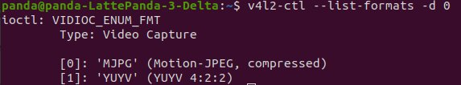

1. as a first step lets check what connected cams do we have:

2. Next install v4l-utils and get more info regarding supported formats: sudo apt install v4l-utils

3. v4l2-ctl --list-formats -d 0

video0 provides compressed images - highly likely framerate for this will be higher

4. now we check resolutions and frame rates
v4l2-ctl --list-formats-ext -d 0 
compressed images support different sizes and 90 fps max

uncompressed images framerate is not so high - and that is bad for robotics in case camera data is used inside demanding control loop

5. The following parameters are available in the camera for tuning:

6. With GStreamer we can try different resolutions and check latency. This command will open video and show it on the screen:
gst-launch-1.0 v4l2src device=/dev/video0 ! \
    image/jpeg,width=1280,height=720,framerate=90/1 ! \
    decodebin ! autovideosink

7. I am pretty much satisfied with image quality and latency at shown above config - now i would like to see how many LattePanda board resources (in terms of CPU and RAM) are consumed during GStreamer is active.
This is what htop shows when GStreamer is active

This is htop when GStreamer is inactive

Nearly 72% of one CPU core is consumed. Memory requirements are miniscular.