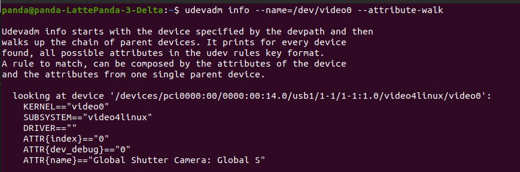
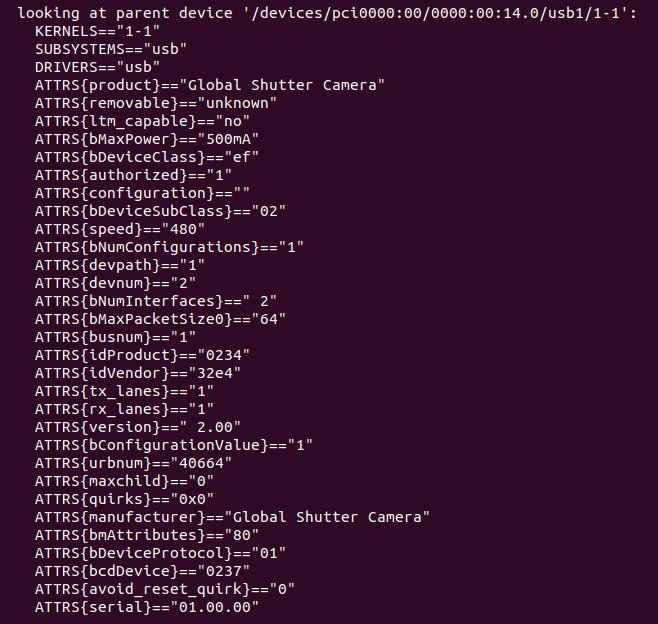

We need to find vendor id and product id of connected USB camera. I use the following tutorial: https://msadowski.github.io/ros-web-tutorial-pt2-cameras/

udevadm info --name=/dev/video0 --attribute-walk

ATTRS{idProduct}=="0234"
ATTRS{idVendor}=="32e4"

