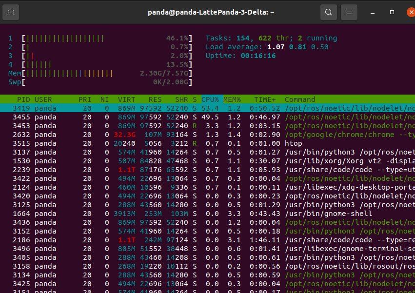

first terminal: roscore
second terminal: roslaunch landing_camera elp.launch
third terminal: rosrun rqt_image_view rqt_image_view

1. CPU and memory check for the following setup:

Without rqt_image (nearly 50% of single core)

With rqt_image (nearly all 4-cores are busy at 50%)

/image_raw topic hz:

2. In future it is possible to decrease camera framerate to 60fps